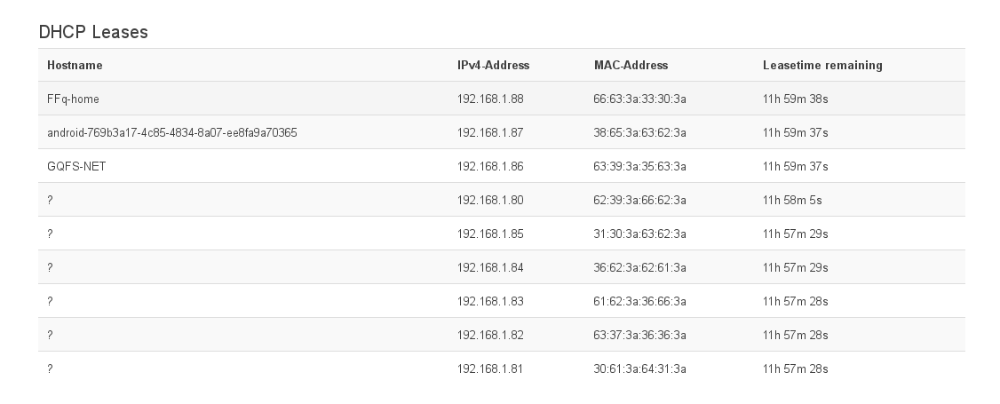

# pyDHCPStarvator

This is a Scapy python program that can run out an entire DHCP pool.
This tool was not created for doing network attacks but like a strategy to exaust a DHCP Rogue pool when security-port and dhcp-snoop features are not available in your network equipments.

### Requirements
````
# python2
apt install python2-pip python-dev
pip install scapy

# python3
apt install python3-dev python3-pip
pip3 install scapy-python3
````
It works better with python2

### Usage
````
usage: starvit.py [-h] -subnet SUBNET [-start N] [-end N]
                  [-server_id SERVER_ID] [-random_hostnames]
                  [-dst_mac DST_MAC] [-timeout TIMEOUT] [-debug DEBUG]


sudo python starvit.py -subnet 192.168.27. -start 120 -end 150

# just add a server_id as a specific target
sudo python starvit.py -subnet 192.168.27. -start 10 -end 253 -server_id 192.168.27.254

# specify server by its MAC address and print packets to stdout
python starvit.py -subnet 192.168.1. -start 80 -end 100 -dst_mac 08:00:27:7C:F9:41 -debug 1
````

#### example stdout with -debug 1
````
Requesting: 192.168.1.98
<Ether  dst=08:00:27:7C:F9:41 src=7b:7b:d1:5a:6b:62 type=IPv4 |<IP  frag=0 proto=udp src=0.0.0.0 dst=255.255.255.255 |<UDP  sport=bootpc dport=bootps |<BOOTP  chaddr=<RandMAC> options='c\x82Sc' |<DHCP  options=[message-type='request' requested_addr=192.168.1.98 end] |>>>>>
.
Sent 1 packets.
````

#### -server_id and -dst_mac
These options focus the attack on a specified endpoint, the DHCP server, by ip or mac address.

If you using a wrong server_id value all the DHCP servers in the l2 broadcast will get something similar in their logs and will not release any ip from their pool.
````
Wed May 16 17:31:35 2018 daemon.info dnsmasq-dhcp[31796]: DHCPNAK(br-lan) 192.168.27.135 30:63:3a:33:38:3a wrong server-ID
````

### Request an IP release
Usefull if you want to force a DHCP server to remove a DHCP lease and then make a client to request an ip again
````
python release_ip.py -src_mac 66:36:3a:37:31:3a -src_ip 192.168.1.93 -dst_mac 08:00:27:7C:F9:41 -dst_ip 192.168.1.1 -debug 1

````

### Results

An OpenWRT DHCP server used as victim.
Someone fake client request was forged with "-random_hostnames" option, someone not.

### Hints
````
# tcpdump activity sniffing
tcpdump -i $ifname -n 'port 67 and port 68'

# dhcp discover
nmap --script broadcast-dhcp-discover -e eth0
````
### License

DHCPStarvator is made by Giuseppe De Marco and it's released under the GPL 3 license.

### Todo

- confiurable MAC randomization (arguments);
- background sniffer that intercept unauthoritative rogue's DHCP NAK and start starvation of source DHCP endpoint
- background unsolicitated DHCP requests, ignore authoritative DHCP and starve all the other DHCPs
- DHCP Server whitelist (do not starvate them)
- please open an issue and suggest :)

### Resources

- http://scapy.readthedocs.io/en/latest/#sniffing
- https://phaethon.github.io/scapy/api/
- https://blog.jasonantman.com/2010/04/dhcp-debugging-and-handy-tcpdump-filters/
- https://www.whitewinterwolf.com/posts/2017/10/30/dhcp-exploitation-guide/
- https://github.com/foreni-packages/dhcpig

### Special thanks
To [Daniele Albrizio](https://github.com/speedj) for given a name to an idea ;)
